

  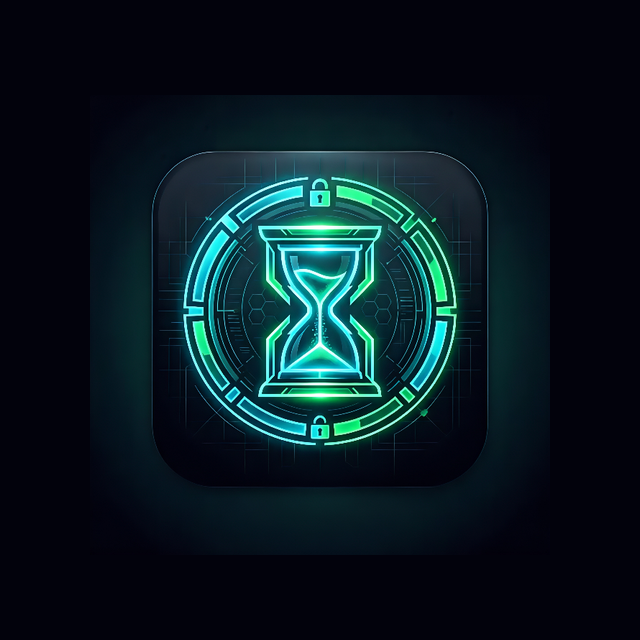
  <h1>Detox Droid</h1>
  
A beautifully designed, local-first Android application to help you regain control over your digital life.

## 🚀 Features

*   **📊 Dashboard & Insights:** Get a clear, at-a-glance view of your daily screen time with an interactive donut chart and a breakdown of your most heavily used apps.
*   **🎯 Focus Mode:** Block distractions and enter deep work. Set a timer (or run indefinitely) to strictly enforce app blocking. Includes an "Emergency Pause" feature with daily limits for urgent situations.
*   **🔒 App Blocking:** Selectively block any installed app on your device. Blocked apps will immediately show a full-screen overlay if opened, preventing usage.
*   **⛔ Doom Scroll Guard:** Break the infinite scroll! Set a time threshold (e.g., 15 minutes). If you spend that much continuous time in a tracked app (like Instagram or TikTok), a full-screen overlay will intervene, breaking your trance and prompting you to take a break.
*   **📈 Weekly Insights:** Track your progress over time. View detailed weekly analytics, daily averages, and usage trends to understand your digital habits better.
*   **📅 Scheduled Detox:** Set it and forget it! Configure automated detox sessions for specific days and times. Perfect for automating your nighttime wind-down or morning routine.
*   **⚙️ Settings:** Personalize your DetoxDroid experience, manage your daily emergency pause limits, and access the "Kill Session" override if needed.

## 📸 Screenshots

### Dashboard & Focus Mode
| Dashboard | Focus Mode Config | Active Session | Settings |
| :---: | :---: | :---: | :---: |
| 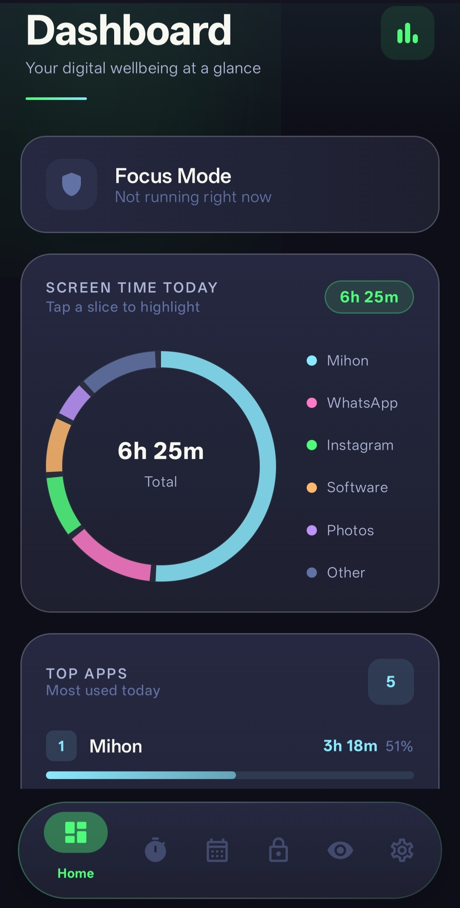 | 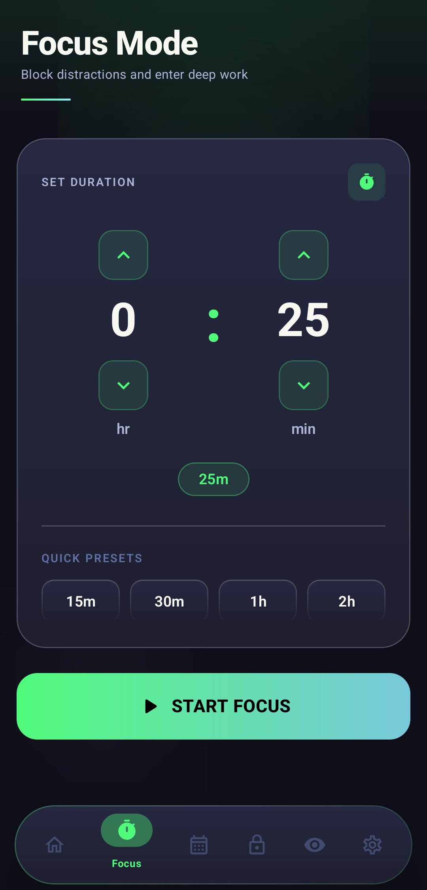 | 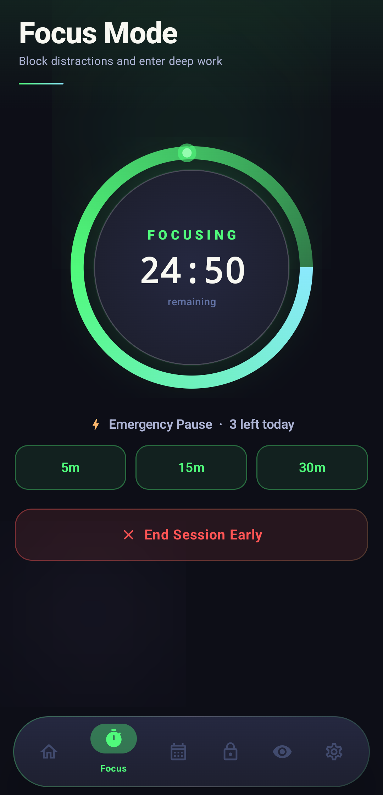 | 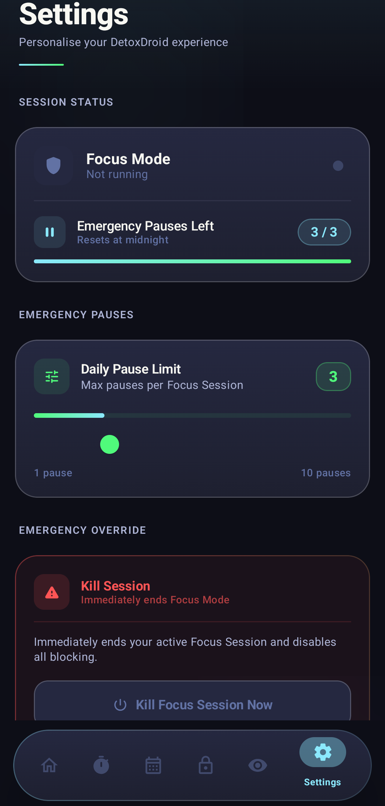 |

### App Blocking
| Configuration | Live Overlay |
| :---: | :---: |
| 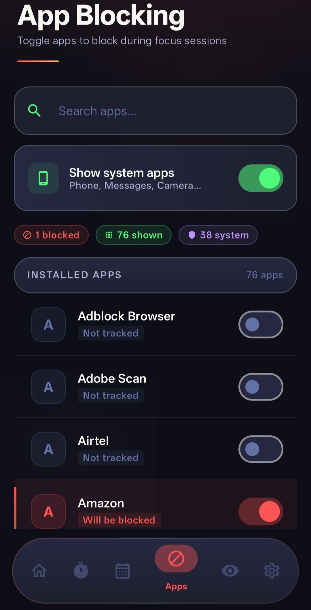 | 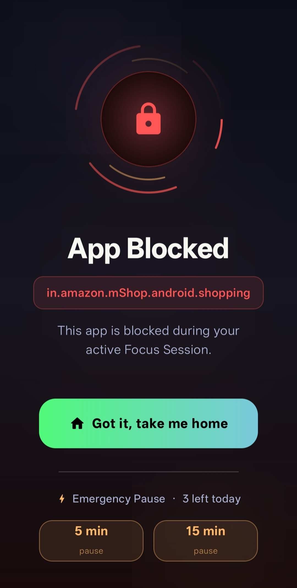 |

### Doom Scroll Guard
| Configuration | Live Overlay |
| :---: | :---: |
| 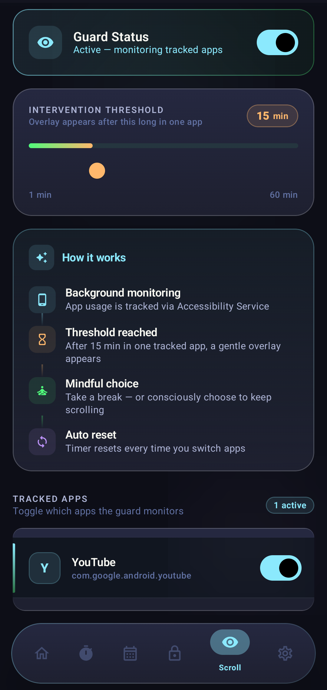 | 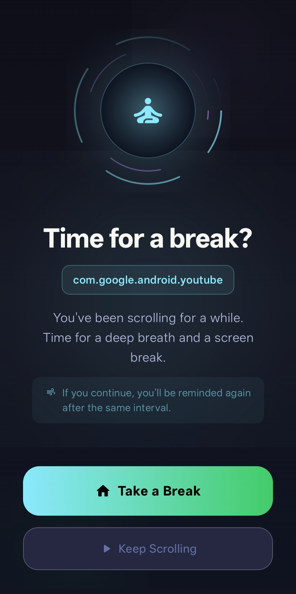 |

### Scheduled Detox
| Schedule List |
| :---: |
| 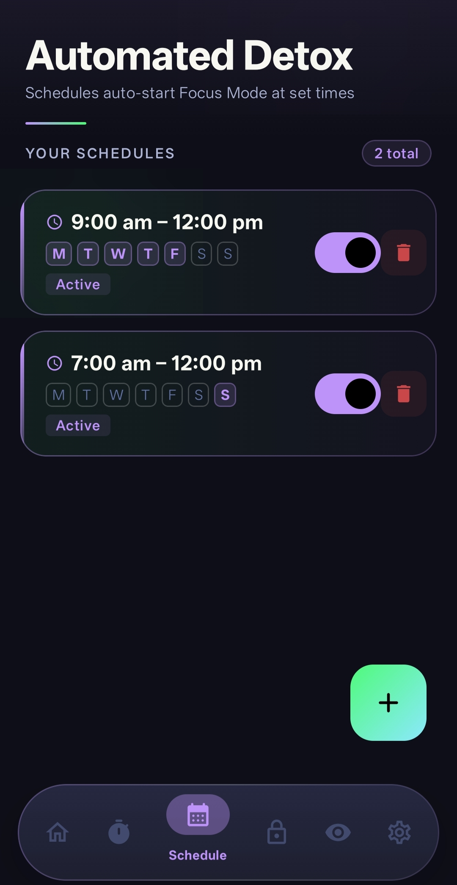 |

### Insights & Trends
| Weekly Overview |
| :---: |
| 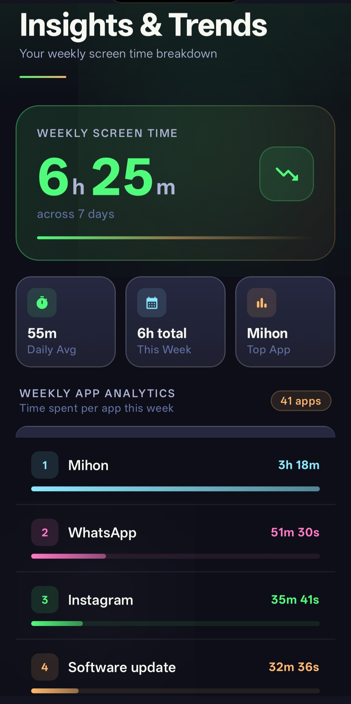 |

## ⚙️ How It Works

1.  **Grant Permissions:** Upon first launch, grant **Accessibility Service** and **Usage Access** permissions. These allow Detox DROID to monitor which apps are in the foreground and intercept them if necessary.
2.  **Foreground Detection:** Our specialized background service continuously (and efficiently) checks the current active app against your blocked list or tracked doom-scrolling apps.
3.  **Instant Intervention:**
    *   **Blocking:** If you open a blocked app, the service instantly triggers a high-priority system overlay that prevents interaction.
    *   **Guarding:** For doom-scrolling apps, the service tracks your continuous session. Once you hit your threshold, an encouragement overlay appears to break the loop.
4.  **Local Fairness:** All tracking and blocking logic happens entirely on your device. No data ever leaves your phone.

## 🛠️ Tech Stack

*   **Language:** Kotlin
*   **UI Toolkit:** Jetpack Compose (Material 3)
*   **Architecture:** MVVM (Model-View-ViewModel) + Clean Architecture
*   **Dependency Injection:** Hilt
*   **Local Data:** Room Database, DataStore Preferences
*   **Background Processing:** Kotlin Coroutines, Jetpack WorkManager
*   **System Integration:** Android Accessibility Service (for app usage tracking)
*   **Navigation:** Jetpack Navigation Compose

## 🧪 Testing & Quality Assurance

Detox Droid prioritizes stability through a robust local-first testing pattern:
*   **Unit Tests:** Implemented using `JUnit4`, `MockK`, and Kotlin Coroutine dispatchers to securely validate presentation state logic (like the `DashboardViewModel`).
*   **UI Tests:** Utilizes Compose `createComposeRule()` to isolate and verify stateless Android UI components (like the screen time donut charts and detox timers) independent of actual framework hardware.
*   **Coverage:** Integrated with **Jacoco**. Run `./gradlew testDebugUnitTest jacocoTestReport` to automatically generate comprehensive HTML/XML code coverage reports.
*   **Crash Handling:** Includes a heavily secure Global Exception Handler built over `Timber` to intercept all fatal crashes natively, ensuring errors are logged prior to Android's default shutdown.

## 🔐 Privacy by Design

Detox Droid is proudly local-first. We believe your digital habits are your private business.
*   **No Cloud Sync:** All screen time data and settings are stored locally on your device.
*   **No Tracking:** We do not collect, analyze, or transmit your app usage data to any external servers.
*   **Offline Functionality:** The app works 100% offline without requiring an internet connection.

## ⚙️ Setup & Installation

1.  Clone the repository to your local machine.
2.  Open the project in Android Studio.
3.  Build and run the app on an Android device or emulator (API 26+).
4.  **Important:** When first launching the app, you will need to grant **Usage Access** and **Accessibility Service** permissions for the tracking and blocking features to function correctly.
